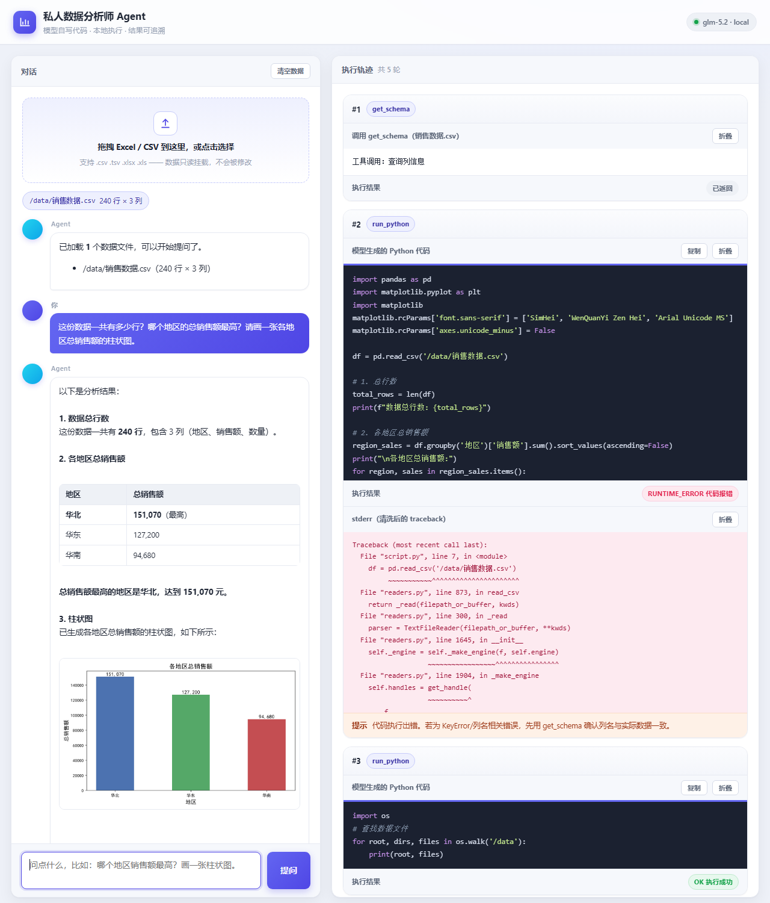
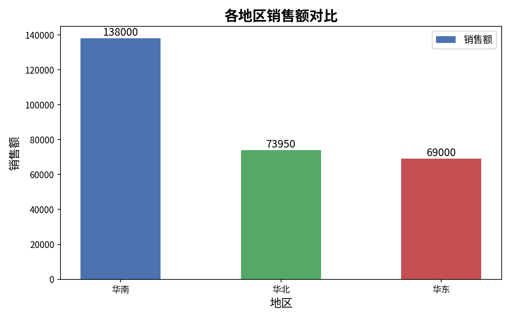

# 私人数据分析师 Agent


基于 Function Calling 的本地数据分析 Agent：上传 Excel / CSV，用自然语言提问，
模型自己写代码、放进 Docker 沙箱跑、看到报错自己改，直到算出结果并出图。

**核心在后端工程：执行隔离、异常分类、成本控制。** 不是一个 UI 套壳。

## 效果演示

下面这张是**真实运行截图**（真模型 + 真前端；本机未启用容器隔离，
因此这一轮用**本地调试执行器**跑，Docker 沙箱仍是默认实现）：



左边是对话，右边是**执行轨迹**。轨迹区把这个 Agent 的底牌全摊开了：

- **模型写的每一段 Python 代码原样展示**（带语法高亮和一键复制）——
  这是用户信任的来源，也是这个项目最该被看见的部分；
- 每一轮的**执行状态徽章**：`OK` 绿、`RUNTIME_ERROR` 红、
  `TIMEOUT`/`OOM` 橙、`REJECTED` 灰，配 `stdout` 与清洗后的 traceback 折叠面板；
- 截图这一轮里出现了一次 **`RUNTIME_ERROR`**：模型第一次按容器路径读数据
  没读到，从**清洗过的 traceback** 里看出真实原因、自己改对并继续 ——
  异常分类 + 自纠闭环的价值就在这一条上；
- 产出的图表直接嵌在轨迹里。

上面这张图是**产物本身**（模型自己写的 pandas + matplotlib 跑出来的）：



自己跑一遍：

```bash
export ZHIPUAI_API_KEY=你的Key
python -m uvicorn src.server:app --port 8000
# 打开 http://127.0.0.1:8000 ，拖一份 CSV / Excel 进去

# 或者不起服务，直接命令行端到端跑一次：
python scripts/demo_agent.py
```

## 当前进度

| 模块 | 状态 | 位置 |
|---|---|---|
| 威胁模型与执行流程图 | ✅ | `docs/sandbox-threat-model.md` |
| Executor 接口契约 | ✅ | `docs/executor-interface.md` |
| 契约层（六分类 / 结构体 / 协议） | ✅ | `src/sandbox/executor.py` |
| 判定与净化逻辑（纯函数） | ✅ | `src/sandbox/analysis.py` |
| Docker 沙箱执行器 | ✅ | `src/sandbox/docker_executor.py` |
| 本地调试执行器 | ✅ | `src/sandbox/local_executor.py` |
| 策略工厂 | ✅ | `src/sandbox/factory.py` |
| 沙箱镜像 | ✅ | `src/sandbox/image/Dockerfile` |
| 真实容器集成测试（`-m docker`） | ✅ 17 项 | `tests/test_docker_integration.py` |
| Schema 提取与成本控制 | ✅ | `src/schema/extractor.py` |
| 手写 Function Calling 循环 | ✅ | `src/agent/` |
| 前端（对话区 + 执行轨迹） | ✅ | `web/index.html` |

## 为什么错误分类是这个项目的地基

闭环是「生成代码 → 执行 → 观察 → 修正」。调用者是模型，它**拿到什么信号
就会往什么方向改**：

```
同一段糟糕的代码 ──▶ 回传 "执行失败"        → 模型只能瞎试，改不到点上
                 ──▶ 回传 TIMEOUT + hint  → 模型去缩减数据量
                 ──▶ 回传 OOM + hint      → 模型去分块读取
                 ──▶ 回传 RUNTIME_ERROR   → 模型去核对列名
```

所以 `ExecStatus` 有六个值，而压不成一句「执行失败」：

| 分类 | 触发条件 | 给模型的信号 |
|---|---|---|
| `OK` | 退出码 0 | — |
| `TIMEOUT` | 宿主墙钟超时，**由外部计时器判定** | 代价太高，去优化数据量 |
| `OOM` | 退出码 137（非超时），或 stderr 出现内存类报错 | 别一次性全读进内存 |
| `RUNTIME_ERROR` | 非零退出 / traceback | 去改代码（附清洗后的栈） |
| `REJECTED` | 静态预检拦下，**没起容器** | 明确告知哪种写法不行 |
| `SANDBOX_ERROR` | 镜像缺失 / daemon 不可达 | 不回填给模型（它改不了） |

## 隔离做了什么

六件事叠起来，缺一个防护面就破：

```
--read-only              根文件系统只读，只有 /out 可写
--network=none           没有任何出网口，掐灭数据外泄
--cpus / --memory        memory-swap 同值禁 swap，超了就杀而不是拖慢机器
--pids-limit=64          防 fork 炸弹打满宿主进程表
--user + no-new-privileges   非 root，无提权空间
最小权限挂载             只挂本次实际用到的文件副本，只读
```

超时是这个实现最容易写错的一环：**计时必须在容器外部** —— 被执行的代码
不可信，它完全可以捕获 `signal.alarm` 或者干脆不响应用户态信号。而且超时
之后还要把已产生的输出读回来，那是排查「为什么会卡死」的唯一线索。

## 快速验证

```bash
# 运行测试（140 项，全部用桩对象，不需要 Docker）
pytest

# 端到端闭环演示：写错 → 结构化反馈 → 改好
python scripts/demo_loop.py

# 装了 Docker 之后：一条命令验证沙箱是否真的可用
python scripts/check_docker.py           # 检查 + 跑隔离探针
python scripts/check_docker.py --build   # 顺手构建沙箱镜像
```

`check_docker.py` 会依次验证 CLI、daemon、镜像，然后真跑几个容器确认
**隔离是否真的生效** —— 注意隔离探针是「**失败**才算对」：
能写出文件、能联网，说明防护没生效。

演示脚本会依次模拟三种情况并打印**回填给模型的完整 payload**：

1. 列名猜错 → `RUNTIME_ERROR` + 清洗后的 traceback
2. 低效实现 → `TIMEOUT`，但 stdout 仍捞回了被杀前打印的内容
3. 修正后 → `OK` + 产物 `summary.txt`

## 明确不做的事

诚实划界，避免把「没做」说成「做了」：

- **不防内核 0day 逃逸**：容器共享宿主内核。要防这类威胁得上 gVisor /
  Kata / 独立虚机，本项目定位是挡住模型写出的常规危险代码。
- **不做多租户隔离**：单用户本地 / 自部署工具。
- **不预算 fork 炸弹之外的攻击**：不防时序 / 缓存侧信道。
- **不引入 LangGraph**：手写 Function Calling 循环，理由见 `AGENTS.md`。
